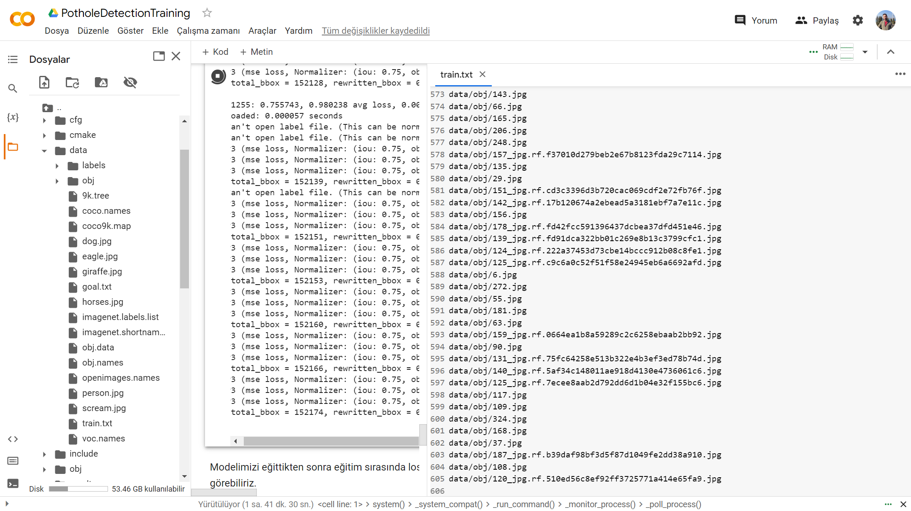
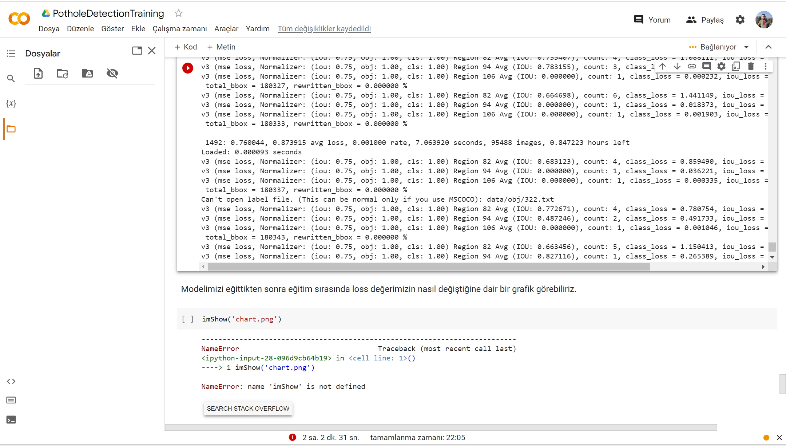
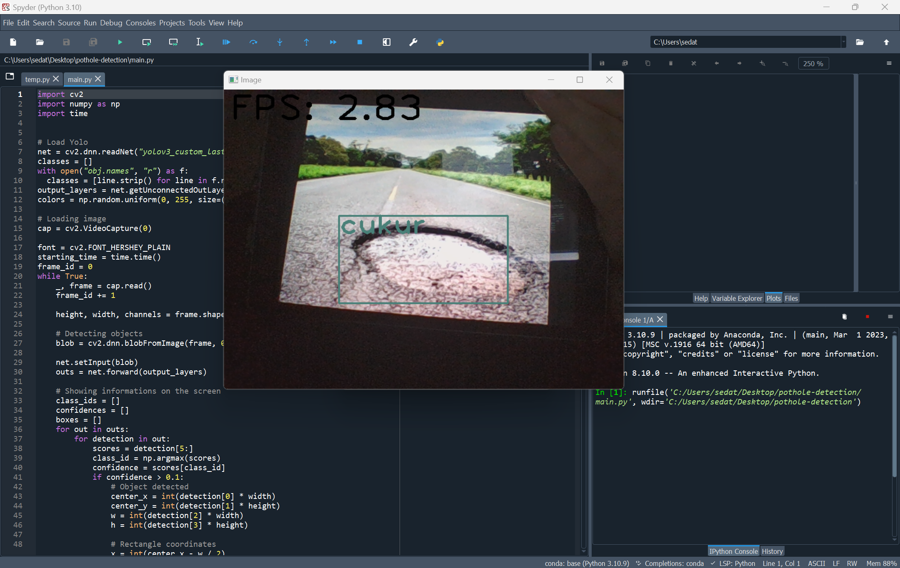
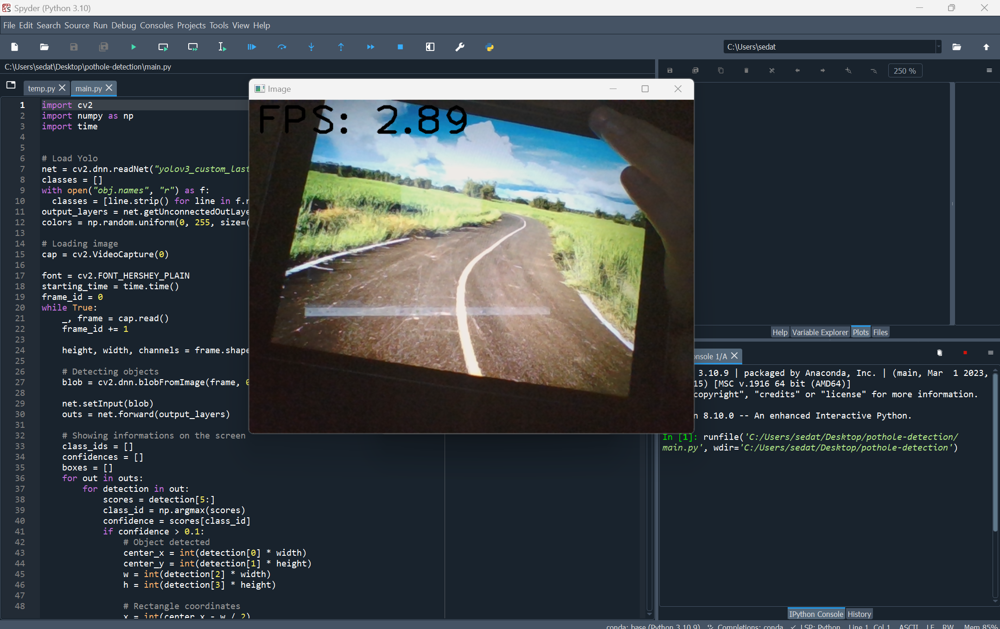
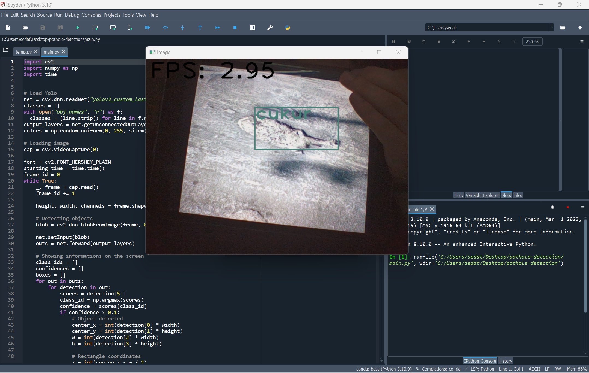

# Pothole Detection with YOLO

We aimed to train a model in this project that detects potholes on the roads with approximately 2k data. The model takes 2-3 images per second from the video source, scans them, and takes them into the square for pothole detection. Thus, it can be integrated into real-time systems without requiring high performance.

## Our Weights

an class name called "cukur" and trained with 95.4888 image . Avg Loss 0.87 so its good like that model .

## Our Datasets
a mixed dataset was created in them

https://www.kaggle.com/datasets/sachinpatel21/pothole-image-dataset?resource=download          

https://www.kaggle.com/datasets/atulyakumar98/pothole-detection-dataset

https://www.kaggle.com/datasets/chitholian/annotated-potholes-dataset

https://www.kaggle.com/datasets/rajdalsaniya/pothole-detection-dataset

https://www.kaggle.com/datasets/salimhammadi07/miia-pothole-image-classification-challenge

## Screenshots

### For Labeling LabelImg 1.8.0 .exe  include in this repository 
-> in docs folder
